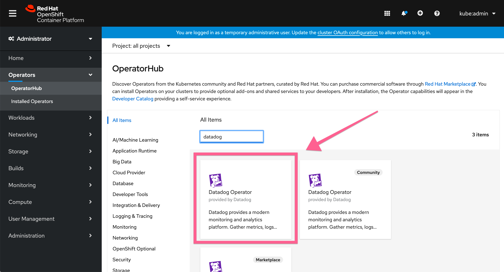
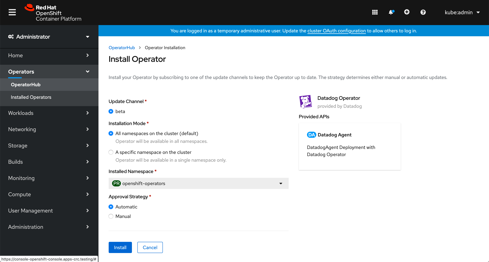
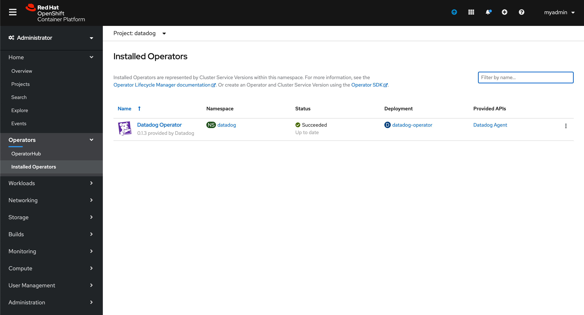
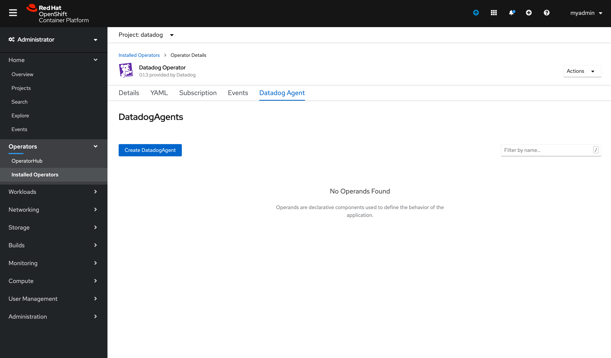
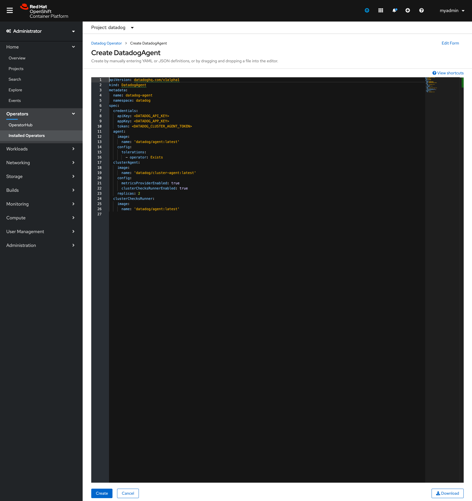
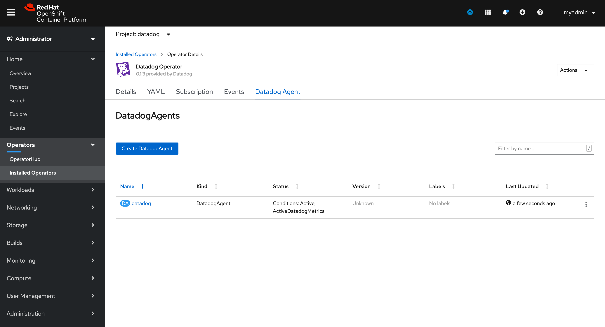

# Setting up the Datadog Agent via the operator.

### Intro
This repository includes information on deploying the Datadog Agent via the operator hosted in the Operator Hub.
Included are example configurations for the operator deployment.
If you have any questions or issues please post them in the issues section of this repository.

### Initial Configuration
This document assumes you have installed the Datadog operator via the processes described [here](https://access.redhat.com/documentation/en-us/openshift_container_platform/4.5/html-single/operators/index#olm-installing-operators-from-operatorhub_olm-adding-operators-to-a-cluster).

Install the Datadog operator (non community version)



Use all the defaults; install the operator in "All Namespaces in the cluster"



Clone this repository to your local computer so that you can make the necessary changes to the SCC's and deployment files.

Create a namespace/project for the Datadog agent installation.   This document assumes that the namespace/project will be "datadog" but the name can be whatever you choose.  *If you choose to use a different namespace/project, the scc and deployment configuration files will need to be updated with that project name.*

```
oc new-project datadog
```

You will also need to deploy a SCC for the agent to have all the rights needed to monitor the OpenShift cluster.   The provided SCC yaml file included in this repository sets up the "custom" deployment scenario that is described in more detail in the [Datadog OpenShift documentation page](https://docs.datadoghq.com/integrations/openshift/#configuration).  If "custom" deployment is the scenario you wish to deploy you can apply this configuration without any modification.   If you want to apply a more restricted deployment you can modify the provided SCC yaml file.    To deploy the repository provided SCC configuration file located [here](https://github.com/ryhennessy/datadog-operator-openshift-example/blob/master/scc.yaml) run the following commands.

Change to the namespace project you created for the Datadog agent install
```
oc project datadog
```

Apply the SCC configuration
```
oc apply -f scc.yaml
```

### Modifying the default configuration provided with this repository
Included in this repository is an example deployment file located [here](https://github.com/ryhennessy/datadog-operator-openshift-example/blob/master/datadog-operator.yaml).
You will need to modify the a few parameters to set up the agent.   As suggested above, it is best to clone this repository to your local computer and make the required modifications there.

The only **required** changes to agent deployment file are to provide the unique API and App key for your Datadog account.  They need to be supplied in the following parameters:

```YAML
spec:
  credentials:
    apiKey: "<Insert API Key Here>"
    appKey: "<Insert APP Key Here>"
```

To enable log collection for the cluster and containers change the following option to **true**:
```YAML
log:
  enabled: false
```

To enable APM trace collection change the following value to **true** and uncomment the hostPort parameter:
```YAML
apm:
     enabled: false
  #   hostPort: 8126
```
To enable process collection for the containers change the following parameter to **true**:
```yaml
process:
  enabled: false
```   


### Deploying the Datadog agent via the operator
#### Via the command line:
Change to the namespace/project you want to instal the agent (if not already there):
```
oc project datadog
```

Deploy the agent via the manifest you modified via the instructions above:
```
oc apply -f datadog-operator.yaml
```

Get the status of the deployment via the following commands
```
# Get the status from the operator:
oc get datadogagent

# Get full list of all the components deployed:
oc get all
```


#### Via the Web Console:
Navigate to **Installed Operators** and validate that you have your Datadog project selected in the project selector at the top.   You should see the Datadog Operator listed.  If you do not find the operator listed, install it via the OperatorHub.




To create a new deployment of the Datadog agent, click on the Datadog Operator and then choose the **Datadog Agent** tab in the operator dialog.   From there you need to click on the **Create DAtadogAgent** button.



This will launch an editor with a default deployment YAML file.   Remove this default deployment YAML and replace it with the modified YAML that was created by following the directions above.  



After clicking the **create** button you will be brought back to the Datadog Operator dialog.  The console should now list the installed agent deployment.   


